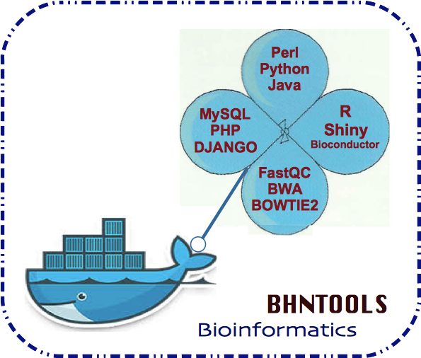

<html>
<head>
  <meta charset="utf-8" />
  <title>DockerBIum</title>
  
</head>
<body>
    <header>
        <section style="color:blue;float:left;padding-right:20px;">
        
        </section>
        <section style="color:navy;float:left;padding-left:15px;">
        <h1>DockerBIum</h1>
        <blockquote>Reproducible bioinformatics workspace with docker under Centos7.</blockquote>
        <h2>Pull the image</h2>
        
 <a href="https://hub.docker.com/r/najlabioinfo/najlabioinfospace">https://hub.docker.com/r/najlabioinfo/najlabioinfospace/</a>

        </section>
    </header>
<article>
<section id="content"style="color:black;float:left;">
<h1 id='idtitle1'>I. What is this?</h1>

Reproducible bioinformatics workspace with docker under Centos7.

<h1 id='idtitle2'>II. How to use it?</h1>
<h2>II.1/ Requirements</h2>
* Docker: <a href="https://docs.docker.com">https://docs.docker.com </a>
<h2>II.2/ Usage</h2>
<ul>
<li>a) From the image </li>
<code style='background: #C0C0C0;'>docker pull najlabioinfo/najlabioinfospace </code>
<li>b) From the Dockerfile</li>
<code style='background: #C0C0C0;'>docker build --tag="yourTag" --file="/pathto/Dockerfile"</code>

 * Dockerfile sample 

<pre style='background: #C0C0C0;'><code>############################################################ 
# Dockerfile based on Centos Image 
############################################################ 
# Set the base image to use to Centos
FROM centos:7
# Set the file maintainer (your name - the file's author) 
MAINTAINER "Najla BEN HASSSINE" bhndevtools@gmail.com
#Prepare env and extra-package install
RUN yum install -y sudo epel-release-7-5.noarch.rpm deltarpm
#MAKE PATH SHAR
RUN mkdir -p /usr/share/info
RUN useradd najlabioinfo \
    && chown najlabioinfo:najlabioinfo /home/najlabioinfo
#Install devtools
RUN yum -y groupinstall "Development Tools"  
RUN yum -y install curl git irb m4 ruby texinfo bzip2-devel curl-devel expat-devel ncurses-devel zlib-devel ghostscript wget cmake git github-backup pandoc gcc g++ kernel-devel htop kpathsea which latex web2c dvips libRmath-devel libRmath zip libreadline-dev readline-devel libreadline pdftailor pdftk mozilla tiff2pdf qpdf xpdf evince which gcc-c++ cairo-devel libpng-devel libX11 libX11-devel qt libjpeg-turbo java info xorg-x11-server-Xvfb firefox texlive
#Needed package for R
RUN yum -y groupinstall X11
RUN yum install -y  libXt-dev libgtk2.0-dev libcairo2-dev xvfb xauth xfonts-base zip libreadline-dev readline-devel libreadline pdftailor pdftk mozilla tiff2pdf texlive qpdf xpdf evince which pdftohtml texinfo inconsolata-fonts
#Updating package
RUN yum update -y
#Install Dev packages
RUN yum install -y  curl gcc make perl git perl-devel expat-devel zlib-devel libbamtools links pdftohtml
#METHODE A : Sample
#-INSTALL firepony
RUN curl -o /etc/yum.repos.d/packages.shadau.com.repo \
    http://packages.shadau.com/rpm/centos-7/packages.shadau.com.repo
RUN yum install -y firepony
</code></pre>

 >> Message success build: Successfully built ID_CONTAINER 

 
<li>c) Upgrading</li>
 The newest version will be always tagged as latest.
</ul>
 
<h2>II.3/ Running</h2>
<ul> - Bioinformatics tools :
<li>R</li>
<pre><code style='background: #C0C0C0;'>docker run -it najlabioinfo/najlabioinfospace R</code></pre>
<li>fastqc</li>
<pre><code style='background: #C0C0C0;'>docker run -it najlabioinfo/najlabioinfospace fastqc --help</code></pre>
<li>BWA</li>
<pre><code style='background: #C0C0C0;'>docker run -ti najlabioinfo/najlabioinfospace bwa meme</code></pre>
<li>bowtie2</li>
<pre><code style='background: #C0C0C0;'>docker run -it najlabioinfo/najlabioinfospace bowtie2 --help</code></pre>
</ul>
<h1 id='idtitle3'>III. Resources</h1>
<h2>III.1/ Documentation</h2>

A comprehensive documentation for docker library is here: <a href="https://github.com/docker-library/docs">https://github.com/docker-library/docs</a>

If you have doubt on how to use Docker, please visit the Docker website : <a href="https://docs.docker.com/engine/reference/builder/">https://docs.docker.com/engine/reference/builder/</a>

<h2>III.2/ References</h2>
<ul>
<li>(ubuntu:14.04.3): Biodocker project: <a href="https://gitter.im/BioDocker/biodocker">https://github.com/BioDocker/biodocker</a> </li>
<li>(Debian): Moreews F, Sallou O, Ménager H et al. <em style="font: bold;">BioShaDock: a community driven bioinformatics shared Docker-based tools registry</em> [version 1; referees: 2 approved]. F1000Research 2015, 4:1443 (doi: 10.12688/f1000research.7536.1)</li>
<li>(Scientific Linux 6.5): Di Tommaso P, Palumbo E, Chatzou M, Prieto P, Heuer ML, Notredame C. <em style="font: bold;">The impact of Docker containers on the performance of genomic pipelines.</em> Campagne F, ed. PeerJ. 2015;3:e1273. doi:10.7717/peerj.1273.</li>
<li>(R): Launch R directly for interactive work here <a href="https://hub.docker.com/_/r-base/">https://hub.docker.com/_/r-base</a>
</ul>
<h1 id='idtitle4'>IV. Issues and Contributing</h1> 
<h2>IV.1/ Support</h2>

If you are having issues, please let me know.

<h2>IV.2/ Contribute</h2>

Bug reports, bug fixes, and new features are always welcome. 
* Issue Tracker: github 
* Source Code: github

<h2 id='idtitleE'>IV.3/ Authors and Maintainers</h2>

BEN HASSINE NAJLA : <a href="MAILTO:bhndevtools@gmail.com?Subject=DockerBIum">bhndevtools@gmail.com</a>

<section style="font: bold;color:green;align:center;font-size:small;">
<footer>BHNtools-copyright2016©</footer>
</section>
</section>
</article>
<aside style='float:right; font:bold; color:navy; align:center; font-size:small; border: 1.5px solid; border-radius:20px; width:200px;'>
 
Topics 
<a href=#idtitle1>I. What is this?</a>
 
<a href=#idtitle2>II. How to use it?</a>
 
<a href=#idtitle3>III. Resources</a>
 
<a href=#idtitle4>IV. Issues and Contributing</a>

</aside>
</body>
</html>
